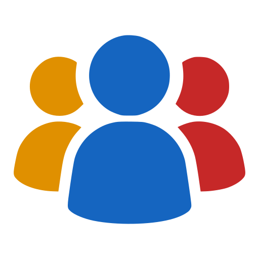

<div align="center">
  <br><br>
  <h1>Squadforces</h1>
  <p>Competitive programming tracker for teams and mentors.</p>

  <p>
    
    
    
    
    
    
  </p>

  <p>
    <a href="https://squadforces.up.railway.app"><strong>Live demo →</strong></a>
  </p>
</div>

---

Squadforces helps coaches track competitive programming progress across their entire squad. Create a group, assign Codeforces and AtCoder contests or standalone problems, and get a unified view of who solved what — live, virtually, or as upsolving.

## Features

- **Multi-platform** — Codeforces and AtCoder contests and standalone problems in a single assignment
- **Smart solve classification** — live, virtual, upsolving, and standalone; the most recent AC determines the type, so re-doing a contest virtually correctly updates its status
- **Assignment matrix** — per-assignment table with every member × every problem; contest rows expand to show per-problem results
- **Difficulty ratings** — CF rating shown per problem; AtCoder difficulty from kenkoooo's display formula
- **30-day leaderboard** — problems solved and contests completed per member per group, updated on every sync
- **Member management** — add members with Codeforces and AtCoder handles; CF handle is validated against the API; handles editable at any time
- **Persistent preferences** — ratings hidden by default, toggle saved per browser

## How syncing works

When a contest or problem is added to an assignment, a background task fetches every group member's submission history and classifies each result. Syncs are **idempotent** — re-running is safe and updates existing records. Sync status per item is tracked (`pending → syncing → done / error`).

Solve types:

| Symbol | Meaning |
|---|---|
| ✓ green | Solved live during the contest |
| ✓ blue | Solved in virtual participation |
| ▲ orange | Upsolved after the contest ended |
| ✓ grey | Solved standalone (no associated contest) |

## Tech stack

| Layer | Choice |
|---|---|
| Backend | FastAPI + Python 3.11, async throughout |
| Templates | Jinja2, server-rendered — no JS build step |
| Interactivity | Inline JS for expand/collapse and rating toggle |
| Database | SQLite via SQLAlchemy ORM (drop-in PostgreSQL support) |
| CF data | Official Codeforces API — anonymous streaming for problem lists, signed requests for user data |
| AtCoder data | [kenkoooo.com](https://kenkoooo.com/atcoder/) AtCoder Problems API, paginated submission fetch |
| Deployment | Railway with persistent SQLite volume at `/data` |

## Setup

```bash
git clone https://github.com/amcbn06/squadforces
cd squadforces
pip install -r requirements.txt
```

Create `.env`:

```env
ADMIN_PASSWORD=your_password
SECRET_KEY=your_secret_key
DATABASE_URL=sqlite:///./squadforces.db

# Optional — enables signed CF API requests (higher rate limits)
CF_API_KEY=
CF_API_SECRET=
```

```bash
python run.py
# → http://localhost:8000
```

---

> Built with [Claude Code](https://claude.ai/code)

## Deployment on Railway

The repo ships with `railway.toml`. Steps:

1. Push to GitHub and connect the repo to Railway
2. Add a volume mounted at `/data`
3. Set `DATABASE_URL=sqlite:////data/squadforces.db`, `ADMIN_PASSWORD`, and `SECRET_KEY` as environment variables
4. Deploy — Railway picks up the start command from `railway.toml` automatically
