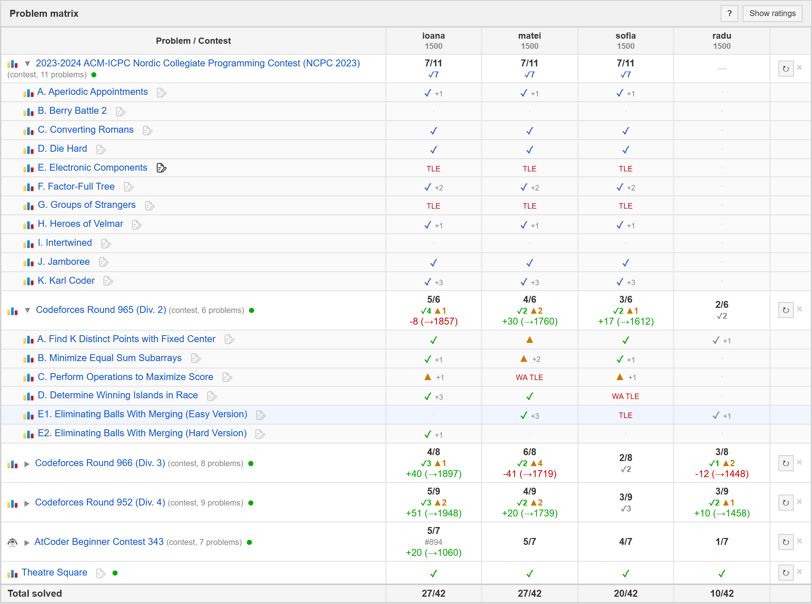
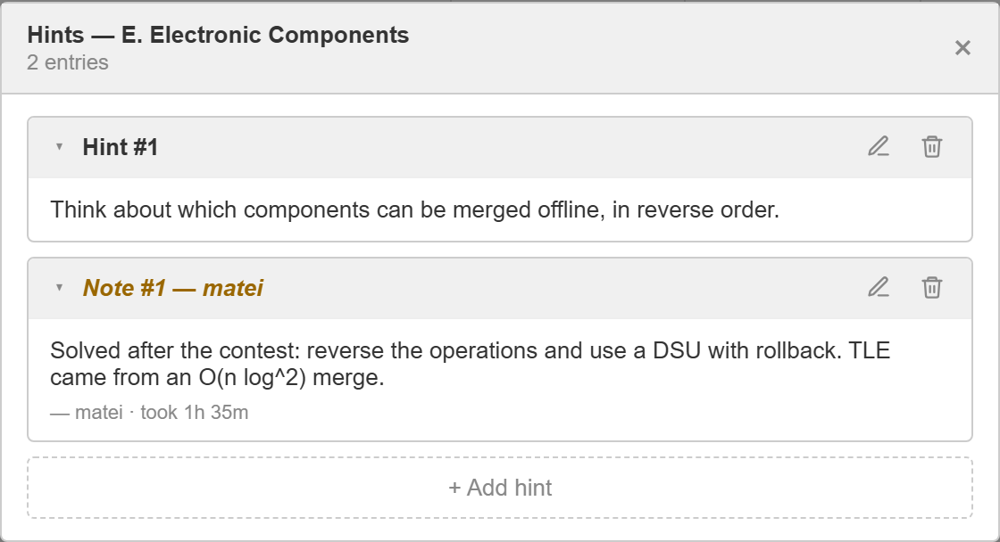
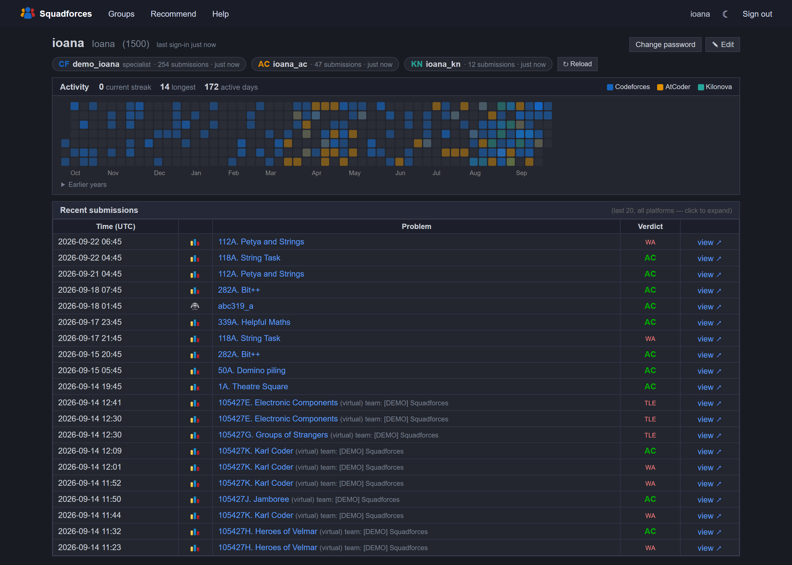
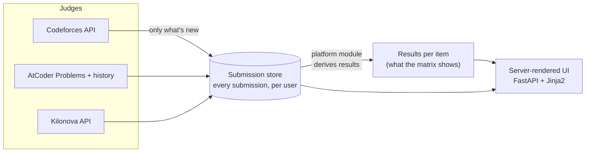

<div align="center">
  <br><br>
  <h1>Squadforces</h1>
  <p><strong>See what your whole competitive-programming team has solved — across Codeforces, AtCoder, Kilonova and CSES — and how: live, virtually, or upsolved.</strong></p>

  <p>
    
    
    
    
    
    
  </p>

  <p>
    <a href="https://squadforces.up.railway.app"><strong>Live app</strong></a> ·
    <a href="#try-it-in-two-minutes-no-accounts-no-network">Try the demo</a> ·
    <a href="#how-it-works">How it works</a> ·
    <a href="https://github.com/amcbn06/squadforces/issues">Roadmap</a>
  </p>
</div>

<p align="center">
  
</p>
<p align="center"><sub>One assignment, four members. A gym contest solved as a <b>team</b> (7/11 for each member), Codeforces rounds split into live ✓, virtual ✓ and upsolved ▲, rating changes, and an AtCoder round. Demo data.</sub></p>

## Why

Coaches and ICPC-style teams practise across several judges, and no single site shows the picture: who has solved this week's problems, who only did it after the editorial, who virtual-participated as a team. Squadforces watches the judges for you. You assign contests and problems, and it shows one matrix of *members × problems* with how each was solved.

It never runs code or hosts problems. It is an **observer** of Codeforces, AtCoder, Kilonova and CSES, so it works with the practice people already do on those sites.

## Features

- **Four judges and plain links.** Codeforces (regular contests, **gyms**, EDU problems), AtCoder, Kilonova problem lists, CSES. Anything else can be added as a link and ticked off by hand.
- **Solve classification that respects how you solved it.** Live, virtual, upsolved (solved after taking part) or standalone practice; the most recent accepted submission decides, so re-doing a contest virtually updates it correctly.
- **Team virtuals.** Codeforces team submissions in gyms count for every member, exactly as Codeforces shows them.
- **Paste links, get items.** A bulk box detects the judge, contest-or-problem and gym/EDU variant from each URL; unknown links are kept, not rejected.
- **Groups anyone can run.** Users create their own groups (up to 5 each, with a member limit of their choice, up to 10) and manage them: assignments, hints, members. The admin can manage every group.
- **Invite links, not open sign-up.** Registration needs a link. The admin makes *platform* links (create an account, optionally straight into a group); group owners make *group* links (an existing user joins). Links expire, have a use limit, can be revoked, and are stored only as a hash. Nobody is added to a group without accepting a link (the admin can always add anyone).
- **Hints and notes per problem.** A group's owner (or the admin) adds hints and solutions; members leave notes with a self-reported time-to-solve.
- **Profiles.** A compact page: a chip per judge (handle, stored submissions, freshness), streaks and a heatmap of the last year across Codeforces, AtCoder and Kilonova (earlier years on demand), and the last 20 submissions in a dropdown with links to the judge.
- **Stays current by itself.** Histories load when a handle is saved and refresh every two hours; only new submissions are fetched.
- **Contest recommendations.** A page that picks recent Codeforces rounds suited to a rating and division, graded by problem difficulty.
- **Accounts done properly.** PBKDF2 password hashing, login throttling, signed sessions that end everywhere when a password changes.

<table>
  <tr>
    <td width="50%"><br><sub>Hints from the coach, notes with time-to-solve from members</sub></td>
    <td width="50%"><br><sub>Profile: one chip per judge, a year of activity across all three judges, and recent submissions in a dropdown (dark theme)</sub></td>
  </tr>
</table>

## How it works



**A local copy of every submission.** Judges are only asked for a user's *submissions*, once. They are mirrored into a table and afterwards refreshed incrementally: everything newer than the newest stored submission, plus anything still being judged. Every contest and problem status is then a database query, so adding the tenth assignment that mentions a contest costs no judge calls. A 15,000-submission history loads in seconds and refreshes in about one.

**One module per judge.** Everything specific to a judge (its links, how to fetch, how to display, how to derive results) lives in `app/platforms/<judge>.py` behind one `Platform` interface. Recognising where a link comes from is a single switch in `app/problems.py`. Supporting a new judge means one new file, one registry line and one `if`; templates never branch on the platform.

**Correctness you can check.** The live/virtual/upsolved logic is tested against the implementation it replaced: identical answers on thousands of random submission histories, and on real Codeforces contests compared against live API calls. The suite (150+ tests, standard-library `unittest`) never touches the network.

**Careful with other people's servers.** Codeforces requests are serialised and spaced 2.1 s apart, concurrent syncs of one user share a single refresh, and a failed judge call leaves stored data untouched and is reported on the item instead of showing false "not solved" cells.

**Safe to deploy over live data.** No migration framework needed for additive changes: new tables come from `create_all`, new columns from an idempotent `ensure_columns()`. The last deploy was rehearsed on a copy of the production database first.

## Try it in two minutes (no accounts, no network)

```bash
git clone https://github.com/amcbn06/squadforces
cd squadforces
pip install -r requirements.txt
python scripts/demo.py
```

Open <http://localhost:8000>. Sign in as `admin` / `demo` (admin), or as a fictional member (`ioana`, `matei`, `sofia`, `radu`) with `demo-pass`. The demo seeds a fictional team with synthetic submissions; contest and problem names are real public data. Every judge API is replaced by an in-memory fake, so the refresh buttons work offline too.

## Run it for real

```bash
pip install -r requirements.txt
cp .env.example .env      # then edit it
python run.py             # http://localhost:8000
```

| Variable | Purpose |
|---|---|
| `ADMIN_PASSWORD` | Password of the admin account, used only when the database is first created; change it later from the **Password** link |
| `SECRET_KEY` | Signs session cookies. Set a long random value in production |
| `DATABASE_URL` | SQLAlchemy URL, default `sqlite:///./squadforces.db` |
| `SYNC_INTERVAL_HOURS` | How often histories and stale items refresh (default `2`) |
| `CF_API_KEY` / `CF_API_SECRET` | Optional: signed Codeforces requests |
| `ALLOW_OPEN_REGISTRATION` | `1` lets anyone sign up without an invite. Leave it off in production; it is for local development and the demo |
| `PUBLIC_URL` | Base URL used in invite links. Defaults to Railway's public domain, then to the address a request came to |

Then sign in as `admin` and open **Admin → Invite links** to make a link for each person (or cohort). They sign up with it, add their handles (their histories load straight away), and can create groups of their own or join others' through group links.

**Existing databases upgrade in place.** Groups made before ownership existed become admin-owned with a member limit of 10 (or their current size if larger), so nothing is removed or moved.

## Security

- Passwords are hashed with PBKDF2-HMAC-SHA256 (600,000 iterations, per-user salt); minimum length 8. Logins are throttled per username (5 failures, then 60 s, doubling), for unknown usernames too.
- Sessions are signed cookies (`HttpOnly`, `SameSite=Lax`, `Secure` when deployed) that end on every device when a password changes. A deployment refuses to start without `SECRET_KEY`, and without `ADMIN_PASSWORD` when it creates the admin account.
- Registration is closed: an account needs an invite link (random, expiring, use-limited, revocable, stored as a hash). Every route is behind sign-in except login, the invite pages and registration; group data needs membership, group management needs ownership (or the admin), and admin actions need the admin account. `tests/test_security.py` and `tests/test_invites_groups.py` check the outsider, member, owner and admin cases.
- **Audit log.** Sign-ins (and failures), password changes, account, group, membership, invite and assignment changes, and refused requests are recorded with who, when, what changed and from which IP. Each entry is written in the same database transaction as the change itself, so one can't exist without the other, and no password or token is ever stored. The admin reads and filters it at **Admin → Audit log**; a group's owner sees only that group's changes, without IPs. Entries are kept 400 days. The admin's user list also shows each account's last sign-in.
- The post-login redirect only accepts paths on this site, and handles are URL-encoded before they reach a judge.
- Dependencies are pinned and audited with `pip-audit`.

Found something? Open an issue, or email the address on the GitHub profile for anything sensitive.

## Deploying on Railway

The repo ships with `railway.toml`.

1. Connect the repo to Railway and add a **volume** mounted at `/data`.
2. Set `DATABASE_URL=sqlite:////data/squadforces.db`, `ADMIN_PASSWORD` and `SECRET_KEY`.
3. Deploy. The start command and health check come from `railway.toml`.

## Project layout

```
app/
  main.py, routers/     routes: groups, assignments, accounts, profiles
  problems.py           the source-detection switch (which judge is this link?)
  platforms/            one module per judge: cf, atc, kn, cses, other  (+ registry)
  submissions.py        the submission store: incremental refresh, queries
  sync.py               refresh members' submissions, then derive an item's results
  scraper/              the HTTP calls to each judge, nothing else
  scheduler.py          periodic refresh
  templates/, static/   server-rendered UI, no JS build step
tests/                  150+ offline tests, incl. the differential classifier tests
scripts/                the offline demo and the screenshot generator
```

## Tests

```bash
python -m unittest discover -s tests -t .
```

## Roadmap

Tracked as [GitHub issues](https://github.com/amcbn06/squadforces/issues): team gym contests with ICPC-style scoring, a curated ICPC contest database with a per-team "which SEERCs did we solve" table, and more profile views.

## License

[MIT](LICENSE). Built with [Claude Code](https://claude.ai/code).
